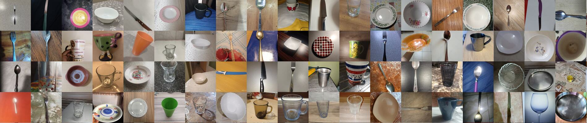

# ML for Image Classification: Kitchenware Kaggle Competition

This repo explores simple CNNs from Keras applications, as well as larger and more powerful deep learning models such as image transformers to classify kitchenware and cutlery. Here we see exploratory data analysis (EDA), tuning different ML models, and hyperparameter search with Keras Tuner.
- Model is submitted to Kaggle as well as having a local and cloud deploy via [BentoML](https://www.bentoml.com/)

## Dataset

Dataset comes from [Kitchenware Classification Kaggle competition](https://www.kaggle.com/competitions/kitchenware-classification)

Includes of glasses, cups, plates, forks, knives and spoons.

If [Kaggle CLI](https://www.kaggle.com/docs/api) is configured, download and unzip with `make dataset`

## Technologies
- Python
- Anaconda
- Pipenv
- CUDA
- Pandas, NumPy
- Tensorflow/Keras
    - CNN models:
        - ConvNext
        - ConvNextV2
        - EfficientNet
    - Image transformer models:
        - MaxViT
        - DaViT
        - CAiT
        - DEiT\*
        - BEiT\**
- BentoML
- Docker
- AWS ECR
- AWS ECS

\* Final model used
\** Used for Kaggle submission

Starter notebook [keras-starter.ipynb](./source/notebooks/keras-starter.ipynb) from this [GitHub repo](https://github.com/DataTalksClub/kitchenware-competition-starter) for DataTalks.Club [ML Zoomcamp](https://github.com/alexeygrigorev/mlbookcamp-code).

## Development Overview:
- Setup environment with Pipenv/Anaconda
- Setup GPU support with CUDA toolkit in WSL2 (Ubuntu)
- [EDA](./source/notebooks/eda.ipynb)
    - Visualize images
    - Visualize class imbalance
    - Visualize image sizes
    - Hypothesis for image augmentation
- Prepare Dataset (80/20 train/validation split)
- Explore different models for fine-tuning
    - Explore CNN models from Keras applications
    - Explore larger CNN models and Image Transformer models from [GitHub repo](https://github.com/leondgarse/)

## Setup

See [Setup instructions](./SETUP.md). Install Git LFS before pulling repo to pull model and weights.

## Use

Refer to [Makefile](./Makefile).
0. (Optional) run `make train` to train model if you did not pull use Git LFS. **Will take very long time if GPU is not configured.**
1. Run `make run` to build BentoML Bento (Docker image and webserver/API) for model and run locally.
    - Can also run `make serve` to serve model from Python
2. After running Bento:
    - Test from script:
        - Evaluate with the image in `testing/` with `make test`
    - Test from web browser:
        - Open http://localhost:3000/
        - Select the first option, to POST
        - Hit `Try it out` in the top right
        - In the drop down box, change `application/postscript` to `image/jpeg`
        - Upload the file `testing/0966.jpg` or any other file from the dataset.
        - Hit `Execute`, wait for your result

Run `make clean` to delete anything generated (including model searches and Bentos)

## Cloud Deploy

See [Walkthrough](./WALKTHROUGH.md) to see screenshots and step-by-step.

**Note**: As a Tensorflow image classification model, this is fairly large (~2.5GB image) and uses a decent amount of resources (~4GB memory).

Must be done after building Bento. This pulls from your AWS **default** profile. Can adjust settings in [Makefile](./Makefile).

Run `make aws` to make ECR repo, push Docker image, create ECS cluster and service with cloudformation. May take 10 minutes.
- What this does:
    1. Creates AWS ECR repo in your local AWS region (`make repo`)
    2. Publishes docker image to ECR repo by tagging local Bento image and pushing
    3. Deploys 3 AWS Cloudformation stacks:
        - Creates VPC and networking
        - Creates ECS Cluster and service
        - Creates ECS task definition to be run
- Unfortunately, I could not figure this out in time, so this step is manual. The Walkthrough shows this with pictures.
    1. Navigate to the [AWS console](https://aws.amazon.com/)
    2. Navigate to AWS ECS from the top bar.
    3. Click on Amazon ECS > **Task Definitions** on the left navigation bar.
    4. Should see Task Definition like 'kitchenware-classification-app-ECSTaskDefinition'. Click on it.
    5. There should only be one Task Definition revision. Click on it or the latest.
    6. Click Actions > **Run Task** from the drop down menu. Make the following selections:
        - `Launch type: FARGATE`
        - `Operating system family: Linux`
        - `Platform version: LATEST`
        - `Number of tasks: 1`
        - `Cluster VPC`: choose the one created by `make aws`
            - On the Cloudformation console, the stack 'kitchenware-classification-vpc' should show the VPC Id in Outputs.
        - `Subnets`: pick either.
        - `Security groups`: Click 'Edit' and add an inbound rule.
            - Specify rule type custom TCP and port 3000
        - `Auto-assign public IP: ENABLED`
    7. Hit button `Run Task`
    8. Click on the newly created task, note the Public IP, and wait for Container Status to become `RUNNING`
    9. Test model by:
        - Test from script with the Public IP:
            - `pipenv run python ./source/test/test_prediction.py ./source/test/0966.jpg "http://<public-ip>:3000`
        - Test by web browser:
            - Open http://<public-ip>:3000/
            - Select the first option, to POST
            - Hit `Try it out` in the top right
            - In the drop down box, change `application/postscript` to `image/jpeg`
            - Upload the file `testing/0966.jpg` or any other file from the dataset.
            - Hit `Execute`, wait for your result
    10. Hit `Stop` in the top right to bring down model. 
- To delete all AWS deploys, run `aws down`. May take 10 minutes.

## Code

0. EDA
    - [eda.ipynb](./notebooks/eda.ipynb)
1. Model experimentation
    - [keras-starter-deit-cait.ipynb](./notebooks/keras-starter-deit-cait.ipynb): explores the DEiT and CAiT transformer models
    - [keras-starter-efficientnet.ipynb](./notebooks/keras-starter-efficientnet.ipynb): explores EfficientNet CNN models
    - [keras-starter-maxvit.ipynb](./notebooks/keras-starter-maxvit.ipynb): explores the MaxViT transformer model
    - [keras-starter-swin.ipynb](./notebooks/keras-starter-swin.ipynb): explores the Swin Transformer model
    - [model-testing.ipynb](./notebooks/model-testing.ipynb): performs a search over some transformer and CNN models
2. Hyperparameter Search
    - [augmentation-test.ipynb](./notebooks/augmentation-test.ipynb): explores augmentation from ImageDataGenerator. None chosen
    - [randaug-testing.ipynb](./notebooks/randaug-testing.ipynb): explores augmentation using the RandAugment auto augmentation policy. Not chosen
    - [learning-rate-test.ipynb)](./notebooks/learning-rate-test.ipynb): searches for learning rate with large search space
    - [learning-rate-final.ipynb)](./notebooks/learning-rate-final.ipynb): searches for learning rate with narrower search space
3. Training
    - [kaggle-submission.ipynb](./notebooks/kaggle-submission.ipynb): submits trained BEiT model for Kaggle competition
    - [trainer.ipynb](./trainer.ipynb): training and bentoml capture of model for deployment (uses DEiT to save on space/time)
    - [trainer.py](./trainer.py): training script made from above notebook
4. Deploy
    - [service.py](./service.py): BentoML service used for Docker/ECS
    - [test_prediction.py](./testing/test_prediction.py): Script for testing service 
