# Walkthrough

1. Running `make repo`
    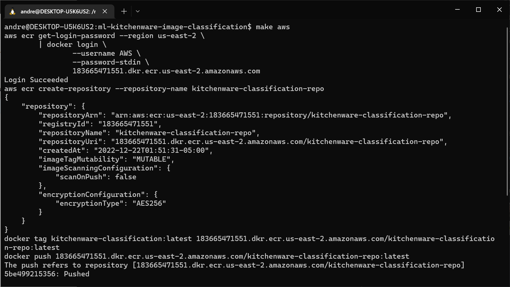
2. Running `make publish`
    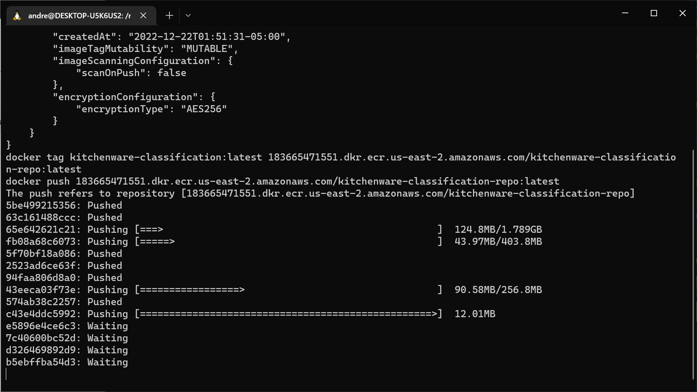
3. Running `make aws`
    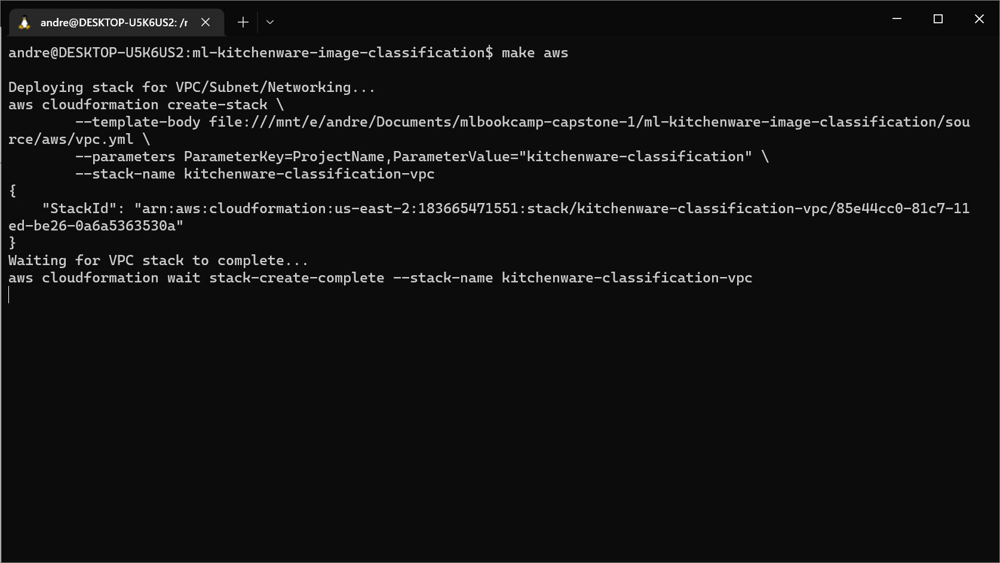
    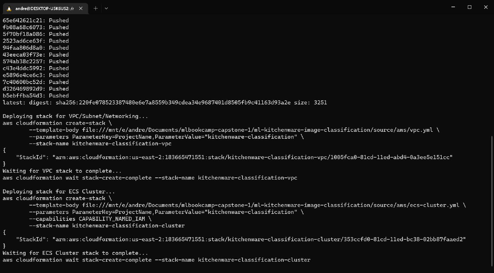
    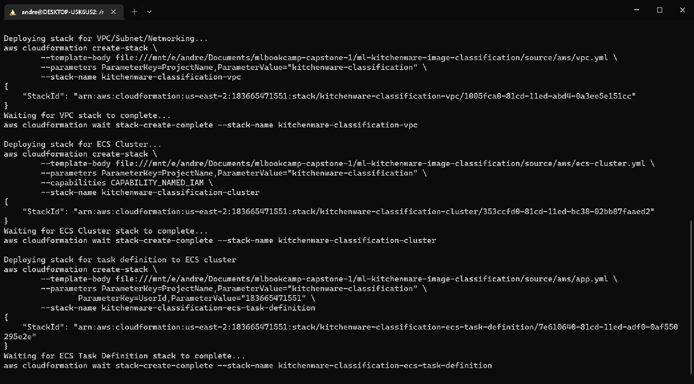
    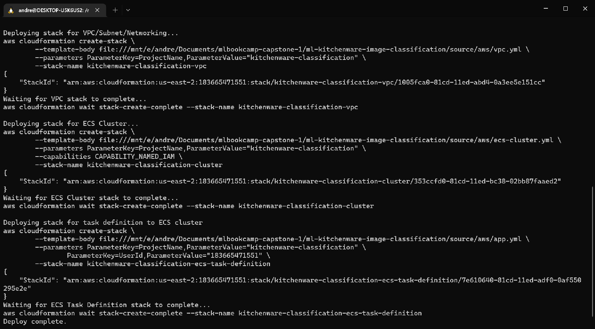
4. Move to AWS and go to ECR. Go to Task Definitions. Click the one like 'kitchenware-classification-ecs-task-definition-ECSTaskDefinition'
    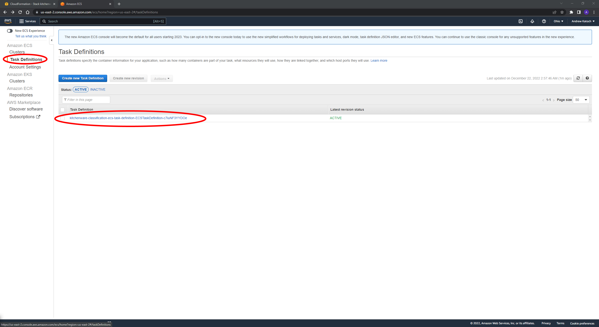
5. Click on the latest revision of the Task definition
    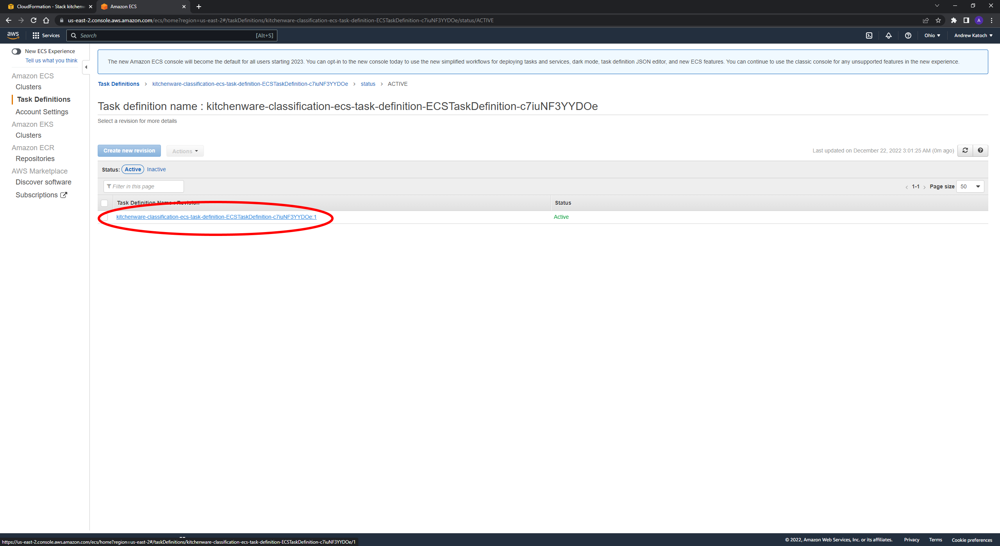
6. Click Actions > Run Task
    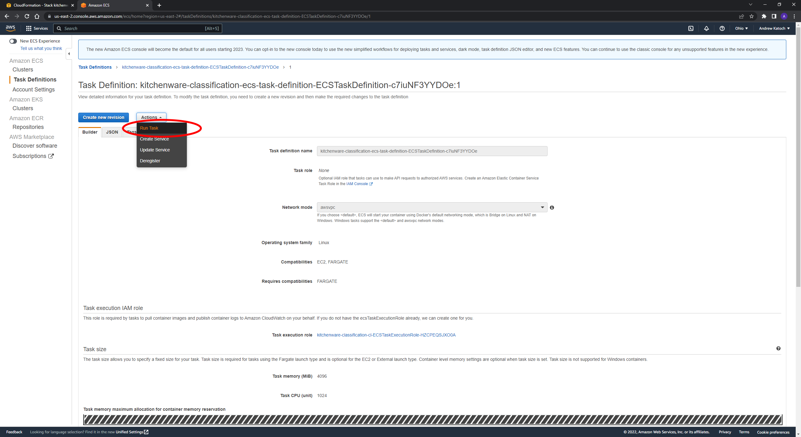
7. Choose the settings in the image. Click the new VPC
    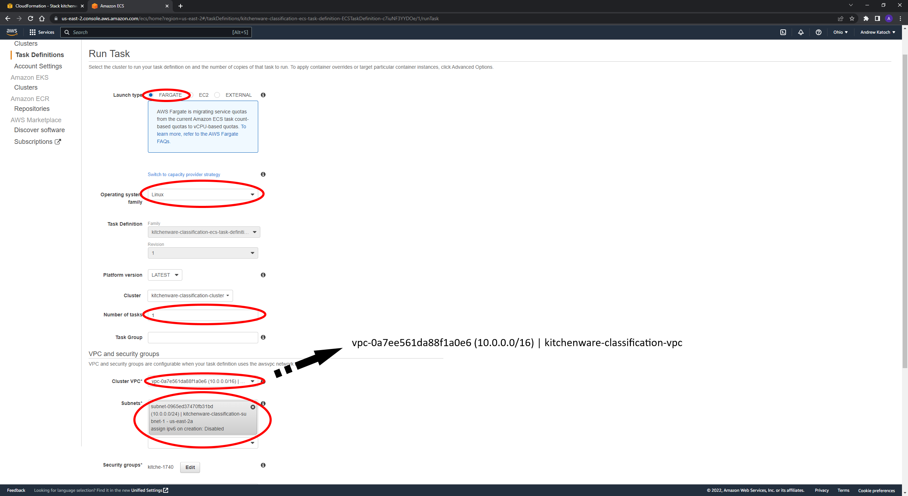
8. Edit the security group and open TCP port 3000
    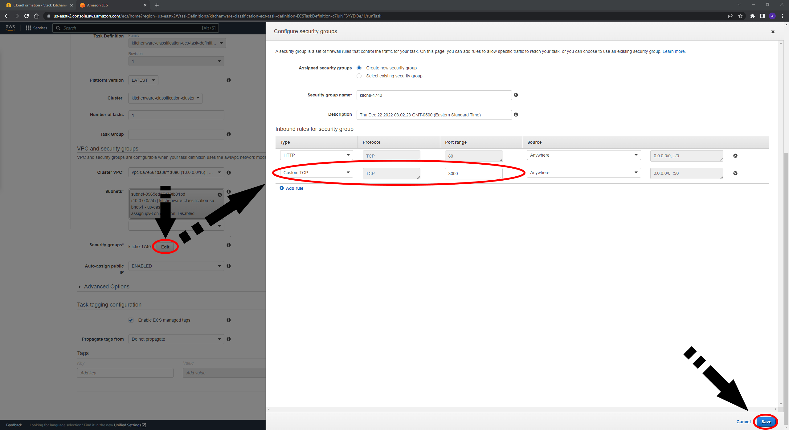
9. Make sure the IP will auto-assign and Run Task
    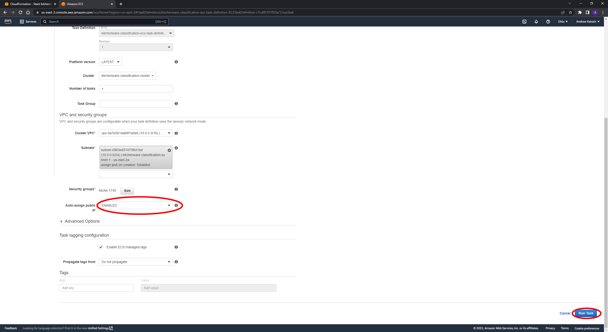
10. Go to the new Task and note the public IP. Wait for the status to say `RUNNING`
    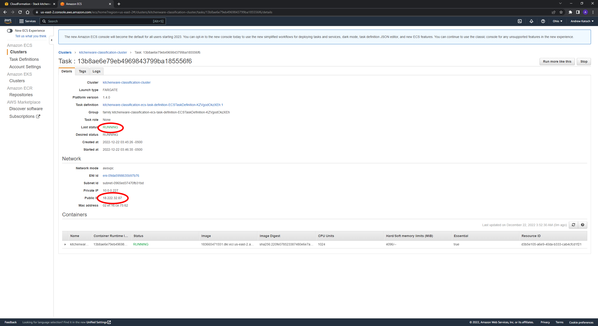
11. Go to the public IP at port 3000 in your web browser (e.g. http://xxx.xxx.xxx.xxx:3000). Click on the POST API
    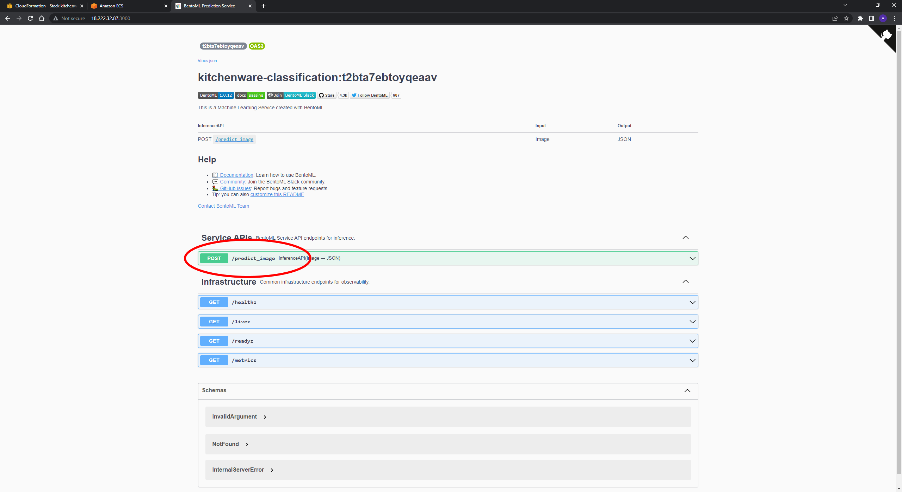
12. Click `Try it out` and set the file type to JPEG image.
    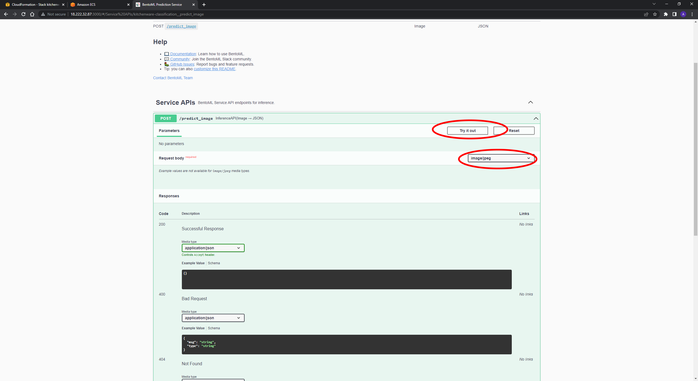
13. Upload the image you want to predict on and hit `Execute`. You will see the prediction in the response body.
    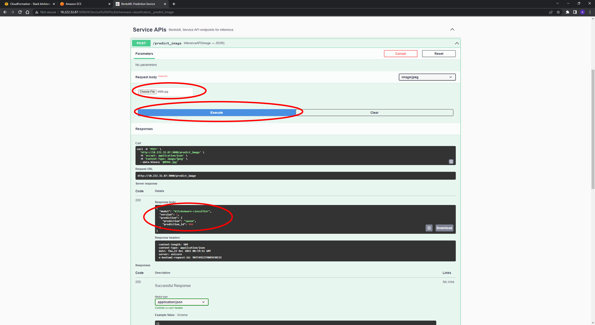